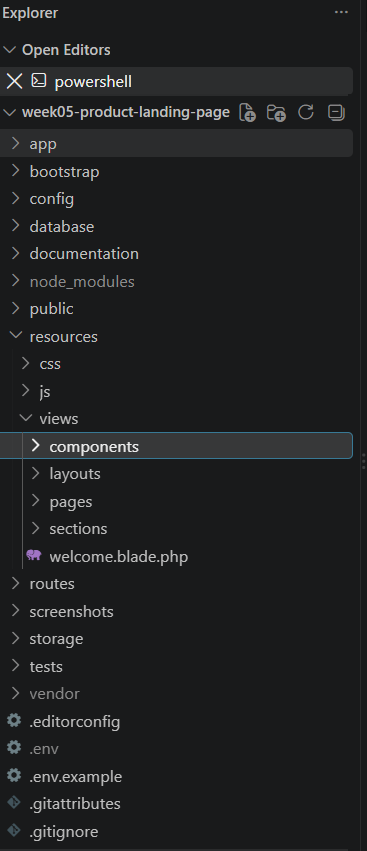
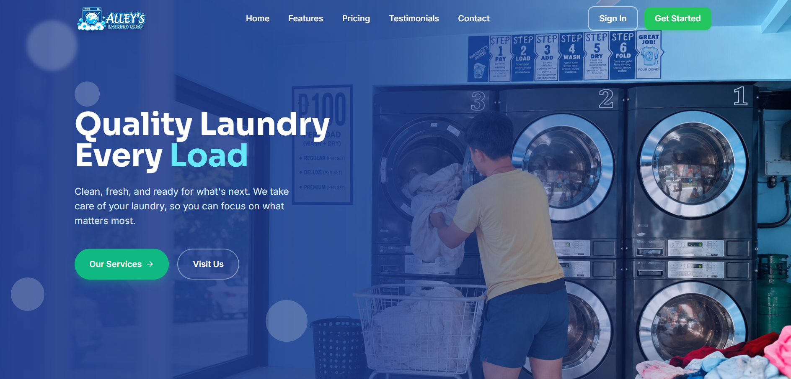
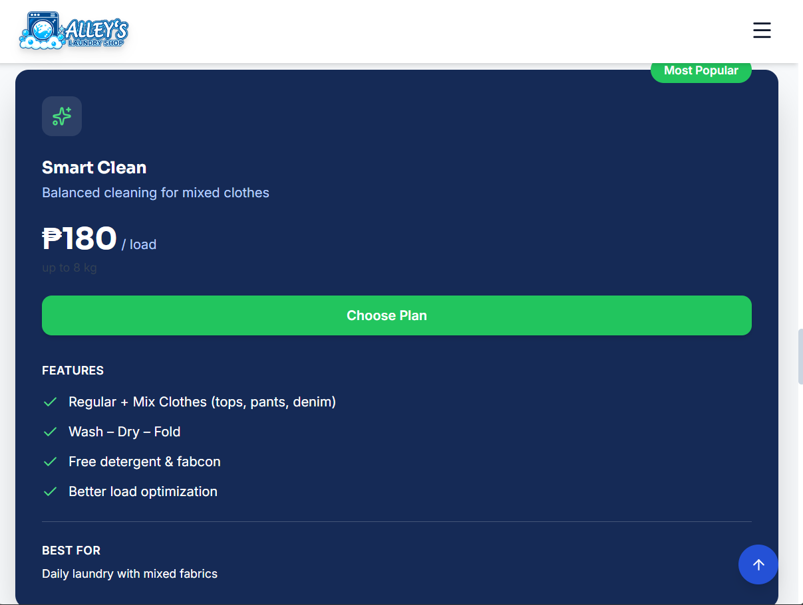
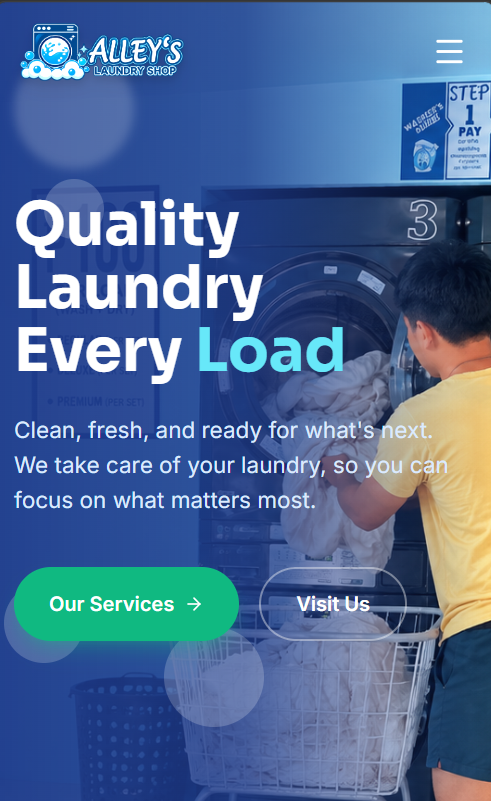
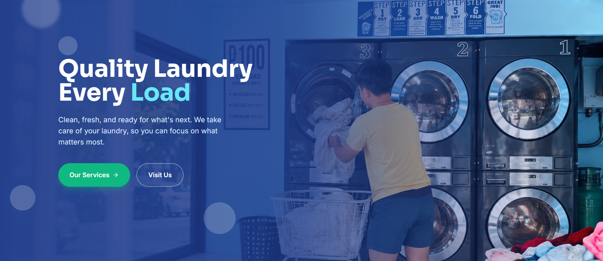
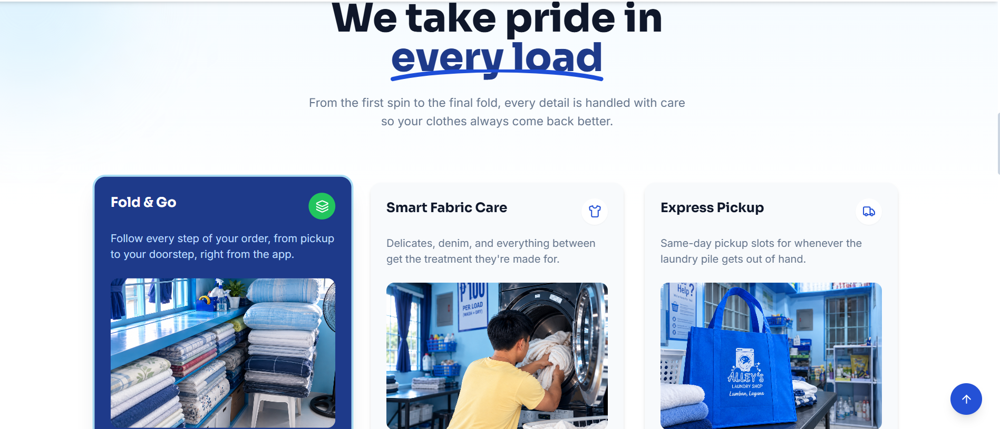
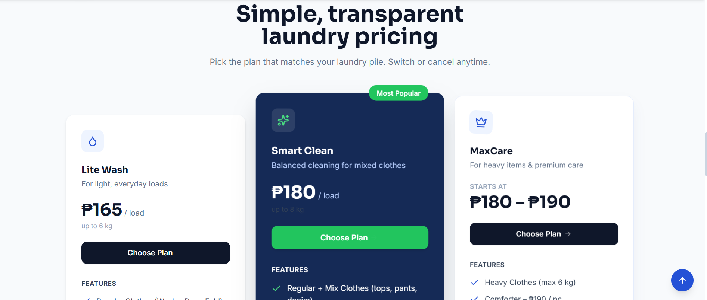
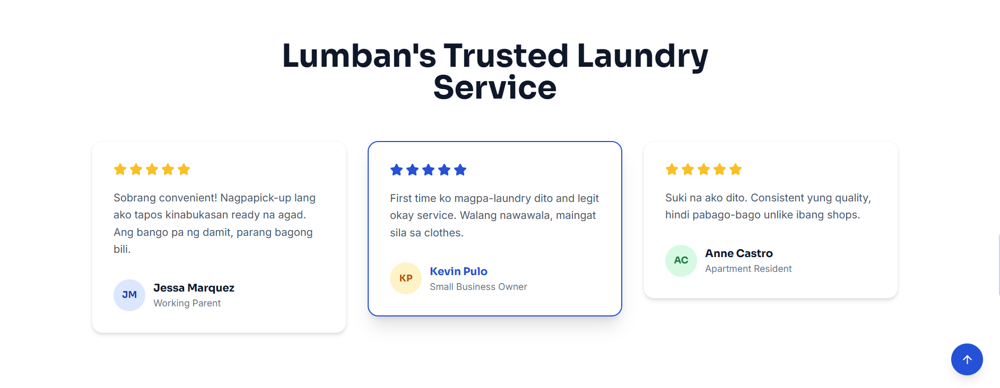
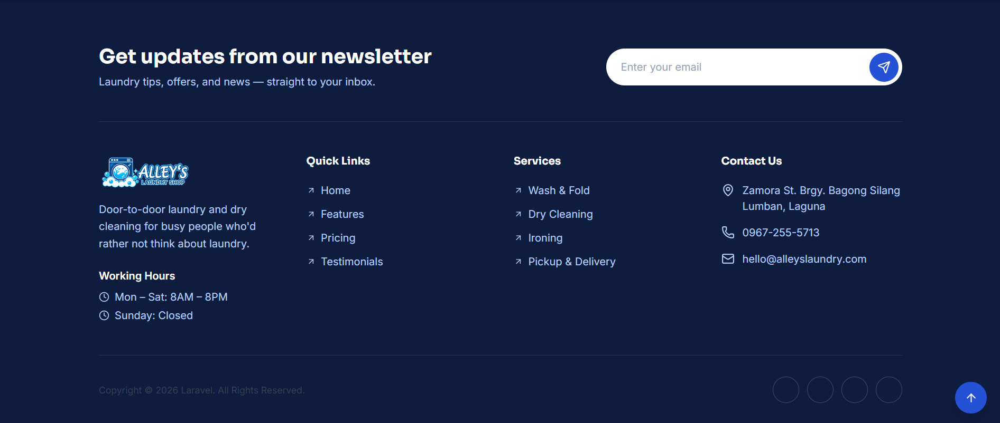
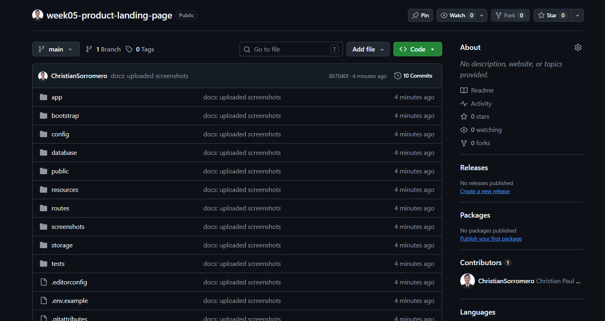

# Product Landing Page

A fully responsive product landing page built with **Laravel Blade Components** and **Tailwind CSS**, designed to showcase a product's features, pricing, and value proposition in a clean, modern, and mobile-friendly interface.

---

## 1. Introduction

### What is a Product Landing Page?
A Product Landing Page is a standalone web page created specifically to introduce a product or service to potential customers and persuade them to take a specific action, such as signing up, making a purchase, or requesting more information. Unlike a general website homepage, a landing page is focused, distraction-free, and built around a single goal: conversion.

### Why Landing Pages Are Important for Businesses
- **First Impressions Matter:** A landing page is often the first interaction a potential customer has with a brand, making design and clarity critical.
- **Focused Messaging:** It communicates a product's value proposition clearly and quickly, without the distractions of a full website.
- **Higher Conversion Rates:** A well-designed landing page guides visitors toward a specific call-to-action (CTA), improving sign-ups, purchases, or inquiries.
- **Marketing Effectiveness:** Landing pages are essential for marketing campaigns, allowing businesses to measure engagement and optimize based on user behavior.
- **Brand Credibility:** A polished, professional landing page builds trust and legitimacy in the eyes of potential customers.

### Purpose of the Project
This project was developed to practice and demonstrate the skills required to build a modern, responsive product landing page using **Laravel Blade Components** for reusable UI structure and **Tailwind CSS** for utility-first styling. The activity focuses on applying responsive web design principles, component-based architecture, and UI/UX best practices to create a production-ready landing page.

---

## 2. Objectives

By completing this activity, the following learning objectives were accomplished:

- Understand and apply the core principles of **Responsive Web Design (RWD)**.
- Build a fully responsive layout using **Flexbox** and **CSS Grid**.
- Utilize **Tailwind CSS** utility classes to style components efficiently without writing custom CSS.
- Create and organize **reusable Blade Components** for a modular and maintainable codebase.
- Design a consistent and visually appealing **User Interface (UI)** with attention to color, typography, and spacing.
- Structure a Laravel project's `resources/views` directory following best practices.
- Test and validate the landing page across **desktop, tablet, and mobile** viewports.
- Document the development process and present the final product through a structured README.

---

## 3. Responsive Web Design

Responsive Web Design (RWD) is an approach to web development that ensures a website renders well across a variety of devices and screen sizes, from mobile phones to large desktop monitors.

### Mobile-First Design
Mobile-first design is a development strategy where the layout is designed for the smallest screen first, then progressively enhanced for larger screens using breakpoints. This approach ensures the core content and functionality are accessible to the largest possible audience, since mobile traffic often represents the majority of web visitors.

### Responsive Breakpoints
Breakpoints are specific screen-width thresholds where the layout adjusts to fit the viewport. In this project, Tailwind's default breakpoints were used:

| Breakpoint | Prefix | Min Width |
|------------|--------|-----------|
| Small      | `sm:`  | 640px     |
| Medium     | `md:`  | 768px     |
| Large      | `lg:`  | 1024px    |
| Extra Large| `xl:`  | 1280px    |
| 2X Large   | `2xl:` | 1536px    |

### Flexbox
Flexbox (`display: flex`) was used throughout the project for one-dimensional layouts such as navigation bars, button groups, and card content alignment. It allowed elements to be aligned, spaced, and distributed dynamically without relying on fixed widths.

### CSS Grid
CSS Grid (`display: grid`) was used for two-dimensional layouts such as the features section and pricing cards, allowing multiple columns and rows to be arranged responsively and consistently across screen sizes.

### User Experience (UX)
Good UX ensures that users can navigate, read, and interact with the page effortlessly regardless of device. This includes readable font sizes, adequately spaced touch targets, fast load times, and intuitive navigation — all of which were prioritized in this project.

### Why Responsive Design Matters
In modern web applications, users access content from a wide range of devices with varying screen sizes. Responsive design ensures a consistent, accessible, and professional experience for every visitor, which directly impacts user satisfaction, SEO ranking, and conversion rates. Without it, businesses risk losing potential customers due to poor usability on mobile or tablet devices.

---

## 4. Tailwind CSS

### Utility-First CSS
Tailwind CSS is a utility-first CSS framework that provides low-level utility classes (e.g., `flex`, `p-4`, `text-center`) to build custom designs directly in the markup, without writing separate CSS files or custom class names.

### Advantages of Tailwind CSS
- **Faster Development:** No need to switch between HTML and CSS files or invent class names.
- **Consistency:** A predefined design system (spacing, colors, typography) ensures visual consistency across the project.
- **Smaller Production Builds:** Tailwind purges unused classes, resulting in optimized file sizes.
- **Highly Customizable:** Easily extendable through the `tailwind.config.js` file.
- **Responsive by Design:** Built-in responsive modifiers make adaptive layouts simple.

### Responsive Utility Classes
Tailwind's responsive prefixes (`sm:`, `md:`, `lg:`, `xl:`) allow different styles to be applied at different breakpoints. For example:

```html
<div class="grid grid-cols-1 sm:grid-cols-2 lg:grid-cols-3 gap-6">
  <!-- Feature cards -->
</div>
```

This class stacks cards in a single column on mobile, two columns on small screens, and three columns on large screens.

### Component Styling
Reusable style patterns, such as buttons and cards, were built using Tailwind's utility classes combined with Blade components. Example button styling:

```html
<button class="bg-indigo-600 hover:bg-indigo-700 text-white font-semibold
               px-6 py-3 rounded-lg shadow-md transition duration-200">
  Get Started
</button>
```

### Examples from the Project
- The **Hero Section** uses `flex flex-col md:flex-row items-center justify-between` to stack content vertically on mobile and horizontally on larger screens.
- The **Pricing Section** uses `grid grid-cols-1 md:grid-cols-3 gap-8` to arrange pricing cards responsively.
- The **Navigation Bar** uses `hidden md:flex` to toggle menu visibility between mobile and desktop views.

---

## 5. Blade Components

### What are Blade Components?
Blade Components are reusable, self-contained pieces of UI in Laravel's Blade templating engine. They combine HTML markup with dynamic data (via props) and can be reused across multiple views, similar to components in frameworks like React or Vue.

Example component structure:

```
resources/views/components/
├── navbar.blade.php
├── hero.blade.php
├── feature-card.blade.php
├── pricing-card.blade.php
├── testimonial-card.blade.php
└── footer.blade.php
```

Example usage in a page:

```blade
<x-navbar />
<x-hero title="Build Faster with Our Platform" />

<div class="grid grid-cols-1 md:grid-cols-3 gap-6">
    <x-feature-card icon="bolt" title="Fast Performance" />
    <x-feature-card icon="shield" title="Secure by Default" />
    <x-feature-card icon="chart" title="Real-time Analytics" />
</div>

<x-footer />
```

Example component definition (`feature-card.blade.php`):

```blade
@props(['icon', 'title', 'description'])

<div class="p-6 bg-white rounded-xl shadow hover:shadow-lg transition">
    <i class="icon-{{ $icon }} text-indigo-600 text-3xl mb-4"></i>
    <h3 class="text-lg font-semibold mb-2">{{ $title }}</h3>
    <p class="text-gray-600">{{ $description }}</p>
</div>
```

### Why Reusable Components Improve Maintainability
- **Single Source of Truth:** Updating a component updates it everywhere it's used, reducing duplicated code.
- **Easier Debugging:** Issues can be isolated to a single component file rather than searched across the entire codebase.
- **Consistency:** Ensures UI elements look and behave the same throughout the application.
- **Faster Development:** New pages can be assembled quickly by composing existing components.

### Benefits of Modular UI Development
Modular development breaks the interface into small, independent, testable pieces. This improves scalability, encourages collaboration (different developers can work on different components), and makes the codebase easier to extend as the project grows.

**Screenshot — Blade Components Folder:**



---

## 6. User Interface Design

### Color Palette
The landing page uses a cohesive color palette centered around an indigo/blue primary color for CTAs and accents, paired with neutral grays for text and backgrounds, and white for content cards. This creates a modern, trustworthy, and professional aesthetic.

### Typography
A clean sans-serif font family (e.g., Inter or Figtree, Laravel's default via Tailwind) is used throughout. Font sizes and weights follow a clear hierarchy — large bold headings for section titles, medium weights for subheadings, and regular weight for body text — to guide the reader's eye naturally.

### Iconography
Simple, consistent line or solid icons are used to visually represent features and benefits, making the content easier to scan and more engaging than text alone.

### Button Styles
Buttons follow a consistent style: rounded corners, solid background colors for primary actions, outlined styles for secondary actions, and hover/transition effects to provide visual feedback.

### Card Design
Cards (used in the Features, Pricing, and Testimonials sections) share a consistent design language: white backgrounds, subtle shadows, rounded corners, and consistent padding, creating a unified and organized visual rhythm.

### Layout Consistency
Consistent spacing, alignment, and section widths are maintained throughout the page using Tailwind's spacing scale and container utilities, ensuring the design feels cohesive from section to section.

### Contribution to User Experience
Together, these UI elements reduce cognitive load, make the page easier to navigate, and build visual trust — all of which contribute to a more enjoyable browsing experience and higher conversion potential.

---

## 7. Folder Structure

```
project-root/
├── resources/
│   └── views/
│       ├── layouts/
│       ├── components/
│       └── pages/
├── public/
├── screenshots/
└── documentation/
```

| Folder | Purpose |
|--------|---------|
| `resources/views/layouts` | Contains master layout templates (e.g., `app.blade.php`) that define the overall page structure, including `<head>`, navigation, and footer, which are extended by individual pages. |
| `resources/views/components` | Houses reusable Blade components (navbar, hero, cards, footer, etc.) used across multiple pages to maintain consistency and reduce duplication. |
| `resources/views/pages` | Contains the main page views (e.g., the landing page itself) that assemble layouts and components into complete screens. |
| `public` | The publicly accessible directory that serves compiled assets (CSS, JS, images) and acts as the entry point for the Laravel application. |
| `screenshots` | Stores image captures of the application used for documentation and presentation purposes. |
| `documentation` | Contains supporting documentation files, notes, and reference material related to the project's development. |

---

## 8. Screenshots

### Desktop View


### Tablet View


### Mobile View


### Navigation Bar


### Hero Section


### Features Section


### Pricing Section


### Testimonials


### Footer


### Blade Components Folder


### GitHub Repository


---

## Tech Stack

- **Laravel** — PHP framework providing routing, Blade templating, and application structure.
- **Blade Components** — Reusable UI building blocks.
- **Tailwind CSS** — Utility-first CSS framework for styling and responsive design.

---

## Author

Project developed as part of a Responsive Web Design and Laravel Blade Components learning activity.